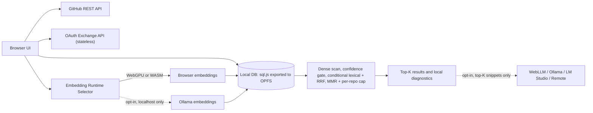

<p align="center">
  
</p>

<p align="center">
  <strong>Encuentra tus repositorios con estrella por memoria, no por nombre.</strong>
</p>

<p align="center">
  <a href="https://git-star-recall.vercel.app/"></a>
  <a href="https://github.com/Abhinandan-Khurana/GitStarRecall/actions/workflows/quality.yml"></a>
  <a href="./LICENSE"></a>
  <a href="https://deepwiki.com/Abhinandan-Khurana/GitStarRecall"></a>
  <a href="./docs/Usage.md"></a>
  <a href="./docs/security-review-stride.md"></a>
</p>

**GitStarRecall** convierte tus estrellas de GitHub en un sistema de memoria buscable. Se ejecuta en tu navegador y
tus datos se quedan allí.

> **Este proyecto existe porque los repositorios con estrella son geniales hasta que tu cerebro dice: "Sé para qué
> sirve, pero no cómo se llama".**

### Pregúntale así

- "Guardé con estrella un repo de pruebas de seguridad GraphQL hace meses, ¿cuál era?"
- "Starter de autenticación TypeScript con límites claros."
- "Recomiéndame los repos más adecuados para mi caso de uso." (Chat LLM)

**_CONSEJO: añade detalles específicos para obtener mejores resultados._**

---

## Pruébalo

Alojado, se ejecuta completamente en tu navegador: **<https://git-star-recall.vercel.app/>**

Continúa con GitHub (solo lectura), haz clic en `Fetch Stars`, y luego busca una vez que finalice la indexación. La aplicación no
almacena tus estrellas, README, embeddings o chats en un servidor de aplicaciones; se quedan en tu dispositivo a menos que
actives explícitamente un LLM remoto.

<!-- Espacio para GIF de demo: graba una consulta vaga -> resultados ordenados -> chat de seguimiento, ~20-40s, sin sonido.
     Usa una cuenta de demo depurada: la grabación muestra repositorios con estrella reales y una identidad de GitHub real. -->

<!-- Descubribilidad: estos pertenecen al campo "topics" del repositorio en GitHub, no al README renderizado:
     github-stars, semantic-search, local-first, rag, browser-embeddings, webllm, ollama,
     privacy, vector-search, mmr -->

---

## Por qué existe

Las personas guardan con estrella muchos repositorios útiles y, más tarde, recuerdan su funcionalidad en lugar de sus nombres. La búsqueda de GitHub es
buena, pero la búsqueda de memoria semántica se adapta mejor a este problema exacto.

GitStarRecall obtiene tus repositorios públicos con estrella, extrae el contenido y metadatos del README, lo fragmenta y
crea embeddings de forma local, te permite buscar en lenguaje natural y, opcionalmente, genera una respuesta de LLM a partir de
las mejores coincidencias locales.

Principios: local-first por defecto, seguridad antes que comodidad, explicabilidad por encima de la "magia", y rendimiento
práctico con cantidades reales de estrellas (1k+ repos).

---

## Lo que obtienes

- Búsqueda en lenguaje natural con recuperación densa, una puerta de confianza, una red de seguridad léxica condicional con
  fusión RRF, seguida de reordenamiento MMR con un límite por repositorio, más diagnósticos locales que explican cada resultado.
- Sincronización de estrellas con diferencias basadas en checksums, obtención de README con reintentos, y fragmentación y
  creación de embeddings local en un grupo de trabajadores con reanudación de puntos de control.
- Embeddings en el navegador impulsados por capacidades (WebGPU con respaldo WASM), o embeddings locales de Ollama activables opcionalmente.
- Sesiones de chat sobre tu índice local, respondidas por proveedores locales, en el navegador (WebLLM) o remotos
  compatibles con OpenAI; cada ruta requiere activación opcional con consentimiento explícito.
- Alcance por identidad de GitHub de cada almacén local, confirmación de eliminación de datos en cinco categorías y
  aplicación de una sola pestaña como escritora donde haya Web Locks disponibles.

Inventario completo: [docs/features.md](./docs/features.md).

---

## Modelo de Seguridad (Versión Breve)

Tus datos se quedan en el navegador a menos que optes explícitamente por un LLM remoto.

**Local por defecto:** metadatos de estrellas, contenido del README, fragmentos y embeddings, historial de chat y configuración;
cada uno con alcance para la cuenta de GitHub autenticada, por lo que una identidad nunca reutiliza el índice local de otra.

**Remoto solo cuando lo habilitas:** contexto de prompt enviado a un proveedor de LLM remoto, solo los top-K fragmentos.

**Postura integrada:** CSP estricta con una lista blanca explícita; intercambio de código OAuth a través de un punto final de backend sin estado para que el secreto del cliente nunca llegue al navegador; las solicitudes OAuth solo piden `read:user` y
la indexación filtra los repositorios privados; respaldo PAT para acceso manual; eliminación confirmada de datos locales;
y documentación basada en modelos de amenazas.

Lee más:

- [Registro de Decisión de Almacenamiento](./docs/adr/README.md)
- [Modelo de Amenazas (STRIDE)](./docs/threat-modeling-stride.md)
- [Revisión de Seguridad (alineación STRIDE)](./docs/security-review-stride.md)
- [Diagramas DFD](./docs/dfd-diagrams.md)
- [Evidencia de endurecimiento v0.14.0](./docs/remediation/v0.14.0.md)

---

## Instantánea de la Arquitectura



Diagramas completos de flujo de datos con fronteras de confianza: [docs/dfd-diagrams.md](./docs/dfd-diagrams.md).

Notas:

- La sincronización de estrellas es activada por el usuario mediante `Fetch Stars`; la búsqueda se ejecuta en embeddings locales existentes.
- La persistencia es una base de datos sql.js (SQLite WASM) única exportada completa a un archivo OPFS con alcance, con una
  instantánea base64 en localStorage como respaldo. Los embeddings son blobs Float32 en tablas ordinarias. No hay
  `sqlite-vec`, no hay tabla virtual vectorial y no hay índice de vecinos más cercanos aproximados.
- El ranking es exacto y en proceso: similitud coseno por fuerza bruta sobre cada vector candidato, luego MMR
  con un límite por repositorio. La red de seguridad léxica y la fusión RRF se activan solo cuando la confianza densa es débil.
- Cada almacén local tiene alcance por identidad de GitHub autenticada, y exactamente una pestaña mantiene la licencia de escritura.
- Las rutas de generación de WebLLM, local y remota son opt-in con controles de consentimiento explícito.

El equilibrio de almacenamiento se registra en el [Registro de Decisión de Almacenamiento](./docs/adr/README.md); el registro de lanzamientos
lista el otro trabajo diferido.

---

## Primeros Pasos

Para desarrollo o autoalojamiento. Para simplemente usar la aplicación, la
[versión alojada](https://git-star-recall.vercel.app/) no requiere instalación.

**Prerrequisitos:** Node.js 22 o 24 (exigido por `engines`), pnpm 11.17.0 (fijado vía `packageManager`;
`corepack enable` lo selecciona), y una aplicación OAuth de GitHub o un PAT con acceso de lectura.

```bash
pnpm install
cp .env.example .env
pnpm dev          # Solo UI, en http://localhost:5173
```

`pnpm dev` **no** sirve `api/github/oauth/exchange.js`, por lo que el intercambio de código OAuth devuelve 404 bajo él.
Un PAT funciona bien, porque la ruta PAT nunca llama al punto final de intercambio. Para el flujo OAuth completo en local,
ejecuta `vercel dev`, que sirve la UI y la ruta serverless juntos.

Variables de entorno, configuración de la aplicación OAuth y despliegue: [docs/Usage.md](./docs/Usage.md).

---

## Comandos para Desarrolladores

- `pnpm dev` - iniciar servidor de desarrollo Vite
- `pnpm lint` - ESLint con `--max-warnings=0`
- `pnpm test` - suite Vitest
- `pnpm build` - verificación de tipos + compilación para producción
- `pnpm ci` - ejecuta la CI completa de gate (formato, lint, tipos, componentes, cobertura, compilación, presupuesto de bundle, e2e)

`pnpm ci` necesita un binario de navegador una vez por checkout:
`pnpm exec playwright install --with-deps chromium`. Desglose completo del gate:
[CONTRIBUTING.md](./CONTRIBUTING.md).

---

## Documentación

- [Guía de Uso](./docs/Usage.md) - configuración, modos de ejecución, ajuste, solución de problemas
- [Inventario de Características](./docs/features.md)
- [Registro de Decisión de Almacenamiento](./docs/adr/README.md)
- [Diagramas DFD](./docs/dfd-diagrams.md)
- [Modelo de Amenazas (STRIDE)](./docs/threat-modeling-stride.md)
- [Revisión de Seguridad (alineación STRIDE)](./docs/security-review-stride.md)
- [Evidencia de Endurecimiento v0.14.0](./docs/remediation/v0.14.0.md) - qué se lanzó, qué se diferió
- [Plan de Aceleración de Embeddings](./docs/embedding-acceleration-plan.md) - hoja de ruta de rendimiento en vivo
- [Registros de Cambios](./docs/changelogs.md)
- [Contribuir](./CONTRIBUTING.md) · [Política de Seguridad](./SECURITY.md) · [Código de Conducta](./CODE_OF_CONDUCT.md)

Conservado solo para trazabilidad, describiendo una arquitectura que nunca se lanzó:
[Tech Stack / PRD](./docs/tech-stack-architecture-security-prd.md) y
[Guía de Construcción](./docs/codex-claude-build-guide.md).

---

## Contribuir

Por favor lee [CONTRIBUTING.md](CONTRIBUTING.md) antes de abrir un PR. Priorizamos la corrección de seguridad,
comportamiento local-first, pruebas deterministas y diagnósticos operativos claros.

---

## Licencia

[MIT](./LICENSE)

## Autor

Hecho con <3 por [Abhinandan-Khurana](https://github.com/Abhinandan-Khurana)
