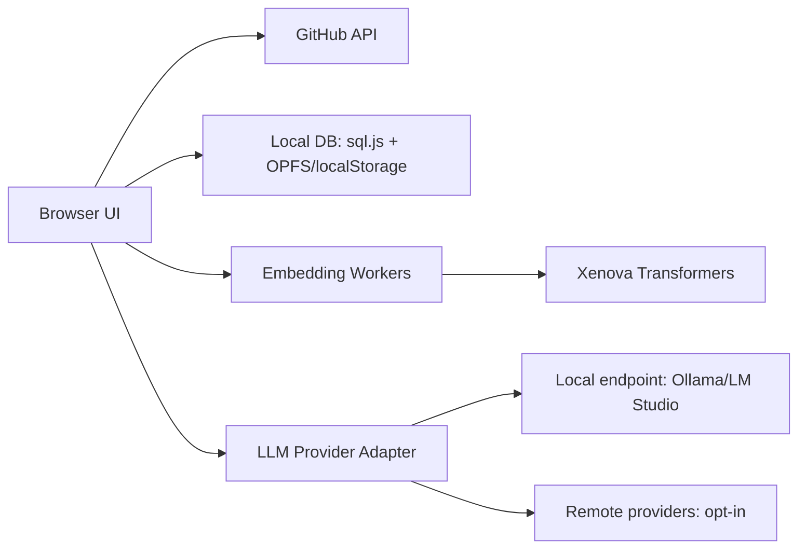

<p align="center">
  
</p>


**Find your starred repos by memory, not by name.**

**GitStarRecall** is a local-first web app that turns your GitHub stars into a searchable memory system.
You can ask things like:
- "I starred a GraphQL security testing repo months ago, what was it?"
- "Show me TypeScript auth projects with clean architecture vibes."
- "Recommend the best-fit repos from my stars for my use case."

**This project exists because starred repos are great until your brain says, "I know what it does, but not what it is called."**

---

## Why This Exists

People star a lot of useful repos.
Later, they remember functionality, not names.
GitHub search is good, but semantic memory search is better for this exact problem.

GitStarRecall solves this by:
- Fetching your starred repositories (including private stars if token scope allows).
- Pulling README content and metadata.
- Chunking and embedding content locally.
- Letting you search in natural language.
- Optionally generating an LLM answer from the top local matches.

---

## Core Principles

- Local-first by default.
- Security before convenience.
- Explainability over magic.
- Practical performance for real star counts (1k+ repos).

---

## Security Model (Short Version)

GitStarRecall is designed to keep your data in the browser unless you explicitly opt into remote LLM usage.

What stays local by default:
- GitHub star metadata.
- README content.
- Chunks and embeddings.
- Chat sessions and message history.

What can go remote (opt-in only):
- Prompt context sent to a remote LLM provider when you enable it.

Built-in security posture:
- Strict CSP with explicit allowlist.
- OAuth code exchange via backend endpoint to avoid exposing client secret.
- PAT fallback supported for power users.
- Local data delete flow for cleanup/reset.
- Threat-model-driven docs in `docs/`.

Read more:
- `docs/tech-stack-architecture-security-prd.md`
- `docs/threat-modeling-stride.md`
- `docs/dfd-and-trust-boundary.md`

---

## Product Capabilities

- GitHub OAuth and PAT authentication paths.
- Star sync with pagination handling.
- Checksum-based diff sync for changed/new/removed stars.
- README fetch pipeline with missing/failure tracking.
- Local chunking + embedding generation.
- Persistent chat sessions with ordered messages.
- Session-aware search and follow-up flow.
- Local and remote LLM answer modes.
- Embedding acceleration controls (batching, worker pool, backend fallback).

---

## Architecture Snapshot



Notes:
- Vector data is stored as Float32 blobs in local SQLite tables.
- Retrieval is local; no server index required.
- Backend preference is configurable: `webgpu` first, `wasm` fallback.

---

## Getting Started

### Prerequisites

- Node.js 20+
- npm 10+
- A GitHub OAuth app (recommended) or GitHub PAT

### Install

```bash
npm install
```

### Configure environment

Copy `.env.example` to `.env` and set values:

```bash
cp .env.example .env
```

Important variables:
- `VITE_GITHUB_CLIENT_ID`
- `VITE_GITHUB_REDIRECT_URI`
- `VITE_GITHUB_OAUTH_EXCHANGE_URL`
- `VITE_EMBEDDING_BACKEND_PREFERRED` (`webgpu` or `wasm`)
- `VITE_EMBEDDING_POOL_SIZE` (1..2)
- `VITE_EMBEDDING_WORKER_BATCH_SIZE` (1..32)
- `VITE_LLM_SETTINGS_ENCRYPTION_KEY=` (openssl rand -hex 32)

If using Vercel OAuth exchange, see:
- `docs/deployment-vercel.md`
- `api/exchange.js`

### Run dev server

```bash
npm run dev
```

### Production build

```bash
npm run build
npm run preview
```

---

## Developer Commands

- `npm run dev` - start Vite dev server
- `npm run lint` - run ESLint
- `npm run test` - run Vitest test suite
- `npm run build` - typecheck + production build
- `npm run ci` - lint + test + build

---

## Performance Tuning

If embedding feels slow on your machine, tune these first:
- `VITE_EMBEDDING_POOL_SIZE=1` on memory-constrained systems.
- `VITE_EMBEDDING_WORKER_BATCH_SIZE=8` (or try `12`/`16`).
- `VITE_EMBEDDING_BACKEND_PREFERRED=wasm` for backend stability diagnostics.

The app exposes indexing telemetry in UI so you can see:
- backend selection/fallback reason,
- throughput,
- checkpoint behavior,
- queue depth,
- worker pool downshift events.

---

## Product Docs

- `docs/starting-point-guide-for-codex-claude.md`
- `docs/step-by-step-implementation-plan.md`
- `docs/embedding-acceleration-plan.md`
- `docs/tech-stack-architecture-security-prd.md`
- `docs/threat-modeling-stride.md`

---

## Contributing

Please read `CONTRIBUTING.md` before opening a PR.

We prioritize:
- security correctness,
- local-first behavior,
- deterministic tests,
- clear operational diagnostics.

---

## License

[MIT](./LICENSE)

---

## Author

- [Abhinandan-Khurana](https://github.com/Abhinandan-Khurana)

### Co-authored with multiple LLMs

This project has been iterated with help from multiple LLM collaborators (GPT, Claude, Gemini, DeepSeek, and others) for design exploration, threat modeling, implementation planning, debugging, and review.

> [!NOTE]
> No AI agents were harmed in the process, lol.
