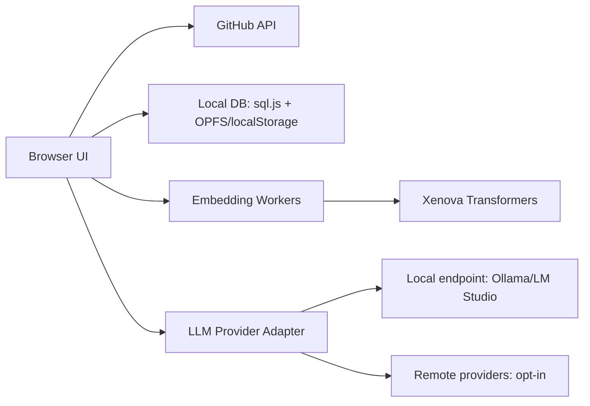

<p align="center">
  
</p>


**Find your starred repos by memory, not by name.**

**GitStarRecall** is a local-first web app that turns your GitHub stars into a searchable memory system.
You can ask things like:
- "I starred a GraphQL security testing repo months ago, what was it?"
- "Show me TypeScript auth projects with clean architecture vibes."
- "Recommend the best-fit repos from my stars for my use case."

**This project exists because starred repos are great until your brain says, "I know what it does, but not what it is called."**

---

## Why This Exists

People star a lot of useful repos.
Later, they remember functionality, not names.
GitHub search is good, but semantic memory search is better for this exact problem.

GitStarRecall solves this by:
- Fetching your starred repositories (including private stars if token scope allows).
- Pulling README content and metadata.
- Chunking and embedding content locally.
- Letting you search in natural language.
- Optionally generating an LLM answer from the top local matches.

---

## Core Principles

- Local-first by default.
- Security before convenience.
- Explainability over magic.
- Practical performance for real star counts (1k+ repos).

---

## Security Model (Short Version)

GitStarRecall is designed to keep your data in the browser unless you explicitly opt into remote LLM usage.

What stays local by default:
- GitHub star metadata.
- README content.
- Chunks and embeddings.
- Chat sessions and message history.

What can go remote (opt-in only):
- Prompt context sent to a remote LLM provider when you enable it.

Built-in security posture:
- Strict CSP with explicit allowlist.
- OAuth code exchange via backend endpoint to avoid exposing client secret.
- PAT fallback supported for power users.
- Local data delete flow for cleanup/reset.
- Threat-model-driven docs in `docs/`.

Read more:
- `docs/tech-stack-architecture-security-prd.md`
- `docs/threat-modeling-stride.md`
- `docs/dfd-and-trust-boundary.md`

---

## Product Capabilities

- GitHub OAuth and PAT authentication paths.
- Star sync with pagination handling (manual via `Fetch Stars`).
- Checksum-based diff sync for changed/new/removed stars.
- README fetch pipeline with missing/failure tracking.
- Adaptive batched README ingestion pipeline (feature-flagged rollout).
- Local chunking + embedding generation.
- Persistent chat sessions with ordered messages.
- Session-aware search and follow-up flow on existing local embeddings.
- Local and remote LLM answer modes.
- Embedding acceleration controls (batching, worker pool, backend fallback).

---

## Architecture Snapshot


```mermaid
flowchart LR
    A[Browser UI] --> B[GitHub API]
    A --> C[Local DB: sql.js + OPFS/localStorage]
    A --> D[Embedding Workers]
    D --> E[Xenova Transformers]
    A --> F[LLM Provider Adapter]
    F --> G[Local endpoint: Ollama/LM Studio]
    F --> H[Remote providers: opt-in]
```

Notes:
- Vector data is stored as Float32 blobs in local SQLite tables.
- Retrieval is local; no server index required.
- Backend preference is configurable: `webgpu` first, `wasm` fallback.

---

## Getting Started

### Prerequisites

- Node.js 20+
- pnpm 9+
- A GitHub OAuth app (recommended) or GitHub PAT

### Install

```bash
pnpm install
```

### Configure environment

Copy `.env.example` to `.env` and set values:

```bash
cp .env.example .env
```

Important variables:
- `VITE_GITHUB_CLIENT_ID`
- `VITE_GITHUB_REDIRECT_URI`
- `VITE_GITHUB_OAUTH_EXCHANGE_URL`
- `VITE_EMBEDDING_BACKEND_PREFERRED` (`webgpu` or `wasm`)
- `VITE_EMBEDDING_POOL_SIZE` (1..2)
- `VITE_EMBEDDING_WORKER_BATCH_SIZE` (1..32)
- `VITE_EMBEDDING_DB_WRITE_BATCH_SIZE` (16..2048)
- `VITE_EMBEDDING_UI_UPDATE_MS` (100..2000)
- `VITE_EMBEDDING_LARGE_LIBRARY_MODE` (`1` or `0`)
- `VITE_EMBEDDING_LARGE_LIBRARY_THRESHOLD` (default `500`)
- `VITE_README_BATCH_PIPELINE_V2` (`1` enables staged README->chunk->embed pipeline)
- `VITE_README_BATCH_SIZE` (default `40`)
- `VITE_EMBED_TRIGGER_THRESHOLD` (pending chunk threshold for rolling embed windows)
- `VITE_EMBED_WINDOW_SIZE` (per rolling embed window)
- `VITE_OLLAMA_BASE_URL` (optional default, must be localhost/127.0.0.1/[::1])
- `VITE_OLLAMA_MODEL` (optional default, e.g. `nomic-embed-text`)
- `VITE_OLLAMA_TIMEOUT_MS`
- `VITE_LLM_SETTINGS_ENCRYPTION_KEY=` (openssl rand -hex 32)

If using Vercel OAuth exchange, see:
- `docs/vercel-deployment.md`
- `api/github/oauth/exchange.js`

### Run dev server

```bash
pnpm dev
```

### Production build

```bash
pnpm build
pnpm preview
```

---

## Developer Commands

- `pnpm dev` - start Vite dev server
- `pnpm lint` - run ESLint
- `pnpm test` - run Vitest test suite
- `pnpm build` - typecheck + production build
- `pnpm ci` - lint + test + build

---

## Performance Tuning

If embedding feels slow on your machine, tune these first:
- `VITE_EMBEDDING_POOL_SIZE=1` on memory-constrained systems.
- `VITE_EMBEDDING_WORKER_BATCH_SIZE=8` (or try `12`/`16`).
- `VITE_EMBEDDING_BACKEND_PREFERRED=wasm` for backend stability diagnostics.

The app exposes indexing telemetry in UI so you can see:
- backend selection/fallback reason,
- throughput,
- checkpoint behavior,
- queue depth,
- worker pool downshift events.

README batching pipeline controls:
- `VITE_README_BATCH_PIPELINE_V2=1` enables batched README ingestion with adaptive concurrency and incremental chunk writes.
- `VITE_README_BATCH_SIZE` tunes mini-batch write size (higher improves throughput, lower reduces memory spikes).
- `VITE_EMBED_TRIGGER_THRESHOLD` and `VITE_EMBED_WINDOW_SIZE` control rolling embedding windows during README ingestion.

### Ollama Embedding Mode (Opt-in)

- Default behavior stays browser-local (`webgpu` -> `wasm` fallback).
- Ollama mode is disabled by default and requires explicit in-app consent toggle.
- Endpoint is restricted to localhost patterns only.
- Payload to Ollama includes only embedding text + model (no GitHub token).
- If Ollama is unavailable, indexing automatically restarts with browser embeddings.

### Ollama Setup

1. Start Ollama locally: `ollama serve`
2. Pull embedding model: `ollama pull nomic-embed-text`
3. In the app, enable `Use Ollama for local embeddings`.
4. Keep base URL as `http://localhost:11434` (or your localhost override).
5. Click `Test connection`.
6. Run `Fetch Stars` to index with Ollama.
7. If Ollama goes down, the app falls back to browser embedding automatically.

### Large-Library Mode

- Automatically enabled when repo count exceeds threshold (`VITE_EMBEDDING_LARGE_LIBRARY_THRESHOLD`, default `500`).
- Prioritizes high-value repos first (stars + recency + README availability).
- Stores resume cursor in `index_meta` so interrupted jobs continue without full restart.
- Search does not refresh stars automatically; click `Fetch Stars` to include newly starred repositories.

### Troubleshooting Large Libraries

1. Check backend/device in embedding run details.
2. Reduce pool size to `1` for memory-constrained systems.
3. Lower worker batch size if batch latency spikes.
4. Keep Ollama enabled only when local endpoint is healthy.
5. Resume from existing checkpoint instead of clearing local data.

---

## Product Docs

- `docs/codex-claude-build-guide.md`
- `docs/step-by-step-implementation-plan.md`
- `docs/embedding-acceleration-plan.md`
- `docs/tech-stack-architecture-security-prd.md`
- `docs/threat-modeling-stride.md`

---

## Contributing

Please read `CONTRIBUTING.md` before opening a PR.

We prioritize:
- security correctness,
- local-first behavior,
- deterministic tests,
- clear operational diagnostics.

---

## License

[MIT](./LICENSE)

---

## Author

- [Abhinandan-Khurana](https://github.com/Abhinandan-Khurana)

### Co-authored with multiple LLMs

This project has been iterated with help from multiple LLM collaborators (GPT, Claude, Gemini, DeepSeek, and others) for design exploration, threat modeling, implementation planning, debugging, and review.

> [!NOTE]
> No AI agents were harmed in the process, lol.
