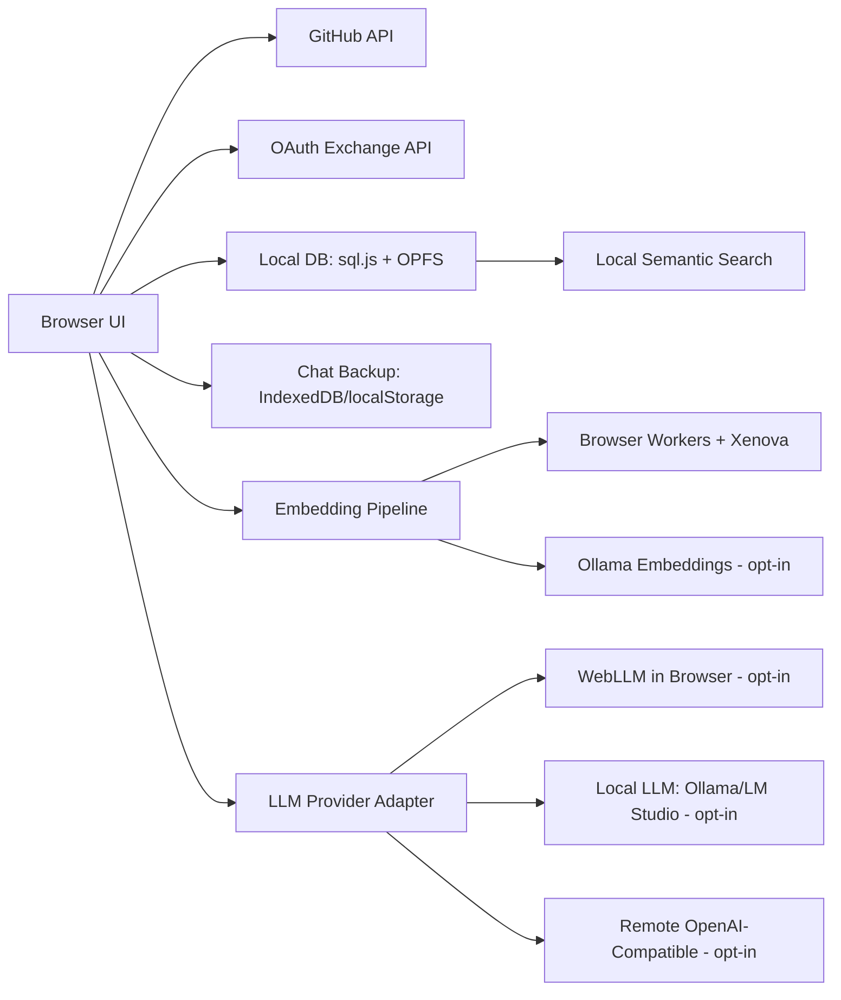

<p align="center">
  
</p>

<h1 align="center">GitStarRecall</h1>

<p align="center">
  <strong>Find your starred repos by memory, not by name.</strong>
</p>

<p align="center">
  <a href="https://deepwiki.com/Abhinandan-Khurana/GitStarRecall"></a>
  <a href="./docs/Usage.md"></a>
  <a href="./docs/release-notes.md"></a>
  <a href="./docs/security-review-stride.md"></a>
</p>

**GitStarRecall** is a local-first web app that turns your GitHub stars into a searchable memory system.

### Ask it like this

- "I starred a GraphQL security testing repo months ago, what was it?"
- "Show me TypeScript auth projects with clean architecture vibes."
- "Recommend the best-fit repos from my stars for my use case."

> **This project exists because starred repos are great until your brain says, "I know what it does, but not what it is called."**

### Keywords

`github stars search` · `semantic search` · `local-first rag` · `browser embeddings` · `webllm` · `ollama` · `privacy-focused ai` · `vector search`

---

## Why This Exists

People star a lot of useful repos.
Later, they remember functionality, not names.
GitHub search is good, but semantic memory search is better for this exact problem.

GitStarRecall solves this by:
- Fetching your starred repositories (including private stars if token scope allows).
- Pulling README content and metadata.
- Chunking and embedding content locally.
- Letting you search in natural language.
- Optionally generating an LLM answer from the top local matches.

Full usage instructions:
- `docs/Usage.md`

---

## Core Principles

- Local-first by default.
- Security before convenience.
- Explainability over magic.
- Practical performance for real star counts (1k+ repos).

---

## Security Model (Short Version)

GitStarRecall is designed to keep your data in the browser unless you explicitly opt into remote LLM usage.

What stays local by default:
- GitHub star metadata.
- README content.
- Chunks and embeddings.
- Chat sessions and message history.

What can go remote (opt-in only):
- Prompt context sent to a remote LLM provider when you enable it.

Built-in security posture:
- Strict CSP with explicit allowlist.
- OAuth code exchange via backend endpoint to avoid exposing client secret.
- PAT fallback supported for power users.
- Local data delete flow for cleanup/reset.
- Threat-model-driven docs in `docs/`.

Read more:
- `docs/tech-stack-architecture-security-prd.md`
- `docs/threat-modeling-stride.md`
- `docs/dfd-diagrams.md`

---

## Product Capabilities

- GitHub OAuth and PAT authentication paths.
- Star sync with pagination handling (manual via `Fetch Stars`).
- Checksum-based diff sync for changed/new/removed stars.
- README fetch pipeline with missing/failure tracking.
- Adaptive batched README ingestion pipeline (feature-flagged rollout).
- Local chunking + embedding generation.
- Persistent chat sessions with ordered messages.
- Session-aware search and follow-up flow on existing local embeddings.
- Local and remote LLM answer modes.
- Browser-local LLM mode via WebLLM (feature-flagged, explicit download consent).
- Embedding acceleration controls (batching, worker pool, backend fallback).

---

## Architecture Snapshot


```mermaid
flowchart LR
    A[Browser UI] --> B[GitHub API]
    A --> X[OAuth Exchange API]
    A --> C[Local DB: sql.js + OPFS]
    A --> C2[Chat Backup: IndexedDB/localStorage]
    A --> D[Embedding Pipeline]
    D --> E[Browser Workers + Xenova]
    D --> G[Ollama Embeddings - opt-in]
    C --> S[Local Semantic Search]
    A --> F[LLM Provider Adapter]
    F --> W[WebLLM in Browser - opt-in]
    F --> L[Local LLM: Ollama/LM Studio - opt-in]
    F --> R[Remote OpenAI-Compatible - opt-in]
```

Notes:
- Star sync is user-triggered via `Fetch Stars`; search runs on existing local embeddings.
- Vector data is stored as Float32 blobs in local SQLite tables.
- Retrieval/search is local; no server-side vector index is required.
- Search v2 can be enabled via `VITE_SEARCH_PIPELINE_V2=1` (repo-centroid prefilter + chunk rerank + diversity cap).
- Embedding backend policy is browser `webgpu` preferred with deterministic `wasm` fallback.
- WebLLM/local/remote generation paths are explicit opt-in with consent controls.

---

## Getting Started

### Prerequisites

- Node.js 20+
- pnpm 9+
- A GitHub OAuth app (recommended) or GitHub PAT

### Install

```bash
pnpm install
```

### Configure environment

Copy `.env.example` to `.env` and set values:

```bash
cp .env.example .env
```

Then follow the complete setup and environment guide:
- `docs/Usage.md`

### Run dev server

```bash
pnpm dev
```

### Production build

```bash
pnpm build
pnpm preview
```

---

## Developer Commands

- `pnpm dev` - start Vite dev server
- `pnpm lint` - run ESLint
- `pnpm test` - run Vitest test suite
- `pnpm build` - typecheck + production build
- `pnpm ci` - lint + test + build
- `pnpm run bench:search` - generate local 384 vs 768 query benchmark snapshot

---

## Usage Guide

For full setup, auth, deployment, runtime modes, tuning, and troubleshooting:
- `docs/Usage.md`

---

## Product Docs

- `docs/Usage.md`
- `docs/codex-claude-build-guide.md`
- `docs/embedding-acceleration-plan.md`
- `docs/tech-stack-architecture-security-prd.md`
- `docs/threat-modeling-stride.md`
- `docs/security-review-stride.md`
- `docs/release-notes.md`

---

## Contributing

Please read `CONTRIBUTING.md` before opening a PR.

We prioritize:
- security correctness,
- local-first behavior,
- deterministic tests,
- clear operational diagnostics.

---

## License

[MIT](./LICENSE)

---

## Author

- Made with <3 by [Abhinandan-Khurana](https://github.com/Abhinandan-Khurana)
