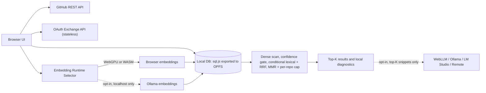

<p align="center">
  
</p>

<p align="center">
  <strong>Find your starred repos by memory, not by name.</strong>
</p>

<p align="center">
  <a href="https://git-star-recall.vercel.app/"></a>
  <a href="https://github.com/Abhinandan-Khurana/GitStarRecall/actions/workflows/quality.yml"></a>
  <a href="./LICENSE"></a>
  <a href="https://deepwiki.com/Abhinandan-Khurana/GitStarRecall"></a>
  <a href="./docs/Usage.md"></a>
  <a href="./docs/security-review-stride.md"></a>
</p>

**GitStarRecall** turns your GitHub stars into a searchable memory system. It runs in your browser, and
your data stays there.

> **This project exists because starred repos are great until your brain says, "I know what it does, but
> not what it is called."**

### Ask it like this

- "I starred a GraphQL security testing repo months ago, what was it?"
- "TypeScript auth starter with clear boundaries."
- "Recommend the best-fit repos for my use case." (LLM chat)

**_TIP: add specific details for better results._**

---

## Try It

Hosted, runs entirely in your browser: **<https://git-star-recall.vercel.app/>**

Continue with GitHub (read-only), click `Fetch Stars`, then search once indexing finishes. The app does not
store your stars, READMEs, embeddings, or chats on an application server; they stay on your device unless
you explicitly enable a remote LLM.

<!-- Demo GIF slot: record a vague query -> ranked results -> follow-up chat, ~20-40s, silent.
     Use a scrubbed demo account: the recording shows real starred repos and a real GitHub identity. -->

<!-- Discoverability: these belong in the repository's GitHub "topics" field, not the rendered README:
     github-stars, semantic-search, local-first, rag, browser-embeddings, webllm, ollama,
     privacy, vector-search, mmr -->

---

## Why This Exists

People star a lot of useful repos, then later remember functionality rather than names. GitHub search is
good, but semantic memory search fits this exact problem better.

GitStarRecall fetches your starred public repositories, pulls README content and metadata, chunks and
embeds it locally, lets you search in natural language, and optionally generates an LLM answer from the
top local matches.

Principles: local-first by default, security before convenience, explainability over magic, and practical
performance at real star counts (1k+ repos).

---

## What You Get

- Natural-language search with dense retrieval, a confidence gate, a conditional lexical safety net with
  RRF fusion, then MMR reranking with a per-repo cap — plus local diagnostics explaining each result.
- Star sync with checksum-based diffing, README fetch with retry, and local chunking and embedding on a
  worker pool with checkpoint resume.
- Capability-driven browser embeddings (WebGPU with WASM fallback), or opt-in local Ollama embeddings.
- Chat sessions over your local index, answered by local, in-browser (WebLLM), or remote
  OpenAI-compatible providers — every path opt-in behind explicit consent.
- Per-GitHub-identity scoping of every local store, confirmed five-category data deletion, and
  single-writer tab enforcement where Web Locks are available.

Full inventory: [docs/features.md](./docs/features.md).

---

## Security Model (Short Version)

Your data stays in the browser unless you explicitly opt into a remote LLM.

**Local by default:** star metadata, README content, chunks and embeddings, chat history, and settings —
each scoped to the authenticated GitHub account, so one identity never reuses another's local index.

**Remote only when you enable it:** prompt context sent to a remote LLM provider, top-K snippets only.

**Built-in posture:** strict CSP with an explicit allowlist; OAuth code exchange through a stateless
backend endpoint so the client secret never reaches the browser; OAuth requests only `read:user` and
indexing filters private repositories out; PAT fallback for manual access; confirmed local-data deletion;
and threat-model-driven documentation.

Read more:

- [Storage Decision Record](./docs/adr/README.md)
- [Threat Model (STRIDE)](./docs/threat-modeling-stride.md)
- [Security Review (STRIDE alignment)](./docs/security-review-stride.md)
- [DFD diagrams](./docs/dfd-diagrams.md)
- [v0.14.0 hardening evidence](./docs/remediation/v0.14.0.md)

---

## Architecture Snapshot


```mermaid
flowchart LR
    UI[Browser UI] --> GH[GitHub REST API]
    UI --> EX["OAuth Exchange API (stateless)"]
    UI --> DB[("Local DB: sql.js exported to OPFS")]
    UI --> EMB[Embedding Runtime Selector]
    EMB -->|WebGPU or WASM| BR[Browser embeddings]
    EMB -.->|opt-in, localhost only| OL[Ollama embeddings]
    BR --> DB
    OL --> DB
    DB --> SE["Dense scan, confidence gate, conditional lexical + RRF, MMR + per-repo cap"]
    SE --> TK[Top-K results and local diagnostics]
    TK -.->|opt-in, top-K snippets only| LLM[WebLLM / Ollama / LM Studio / Remote]
```

Full data-flow diagrams with trust boundaries: [docs/dfd-diagrams.md](./docs/dfd-diagrams.md).

Notes:

- Star sync is user-triggered via `Fetch Stars`; search runs on existing local embeddings.
- Persistence is a single sql.js (SQLite WASM) database exported whole to a scoped OPFS file, with a
  base64 localStorage snapshot as fallback. Embeddings are Float32 blobs in ordinary tables. There is no
  `sqlite-vec`, no vector virtual table, and no approximate-nearest-neighbour index.
- Ranking is exact and in-process: brute-force cosine similarity over every candidate vector, then MMR
  with a per-repo cap. The lexical safety net and RRF fusion engage only when dense confidence is weak.
- Every local store is scoped per authenticated GitHub identity, and exactly one tab holds the write lease.
- WebLLM, local, and remote generation paths are opt-in with explicit consent controls.

The storage trade-off is recorded in the [Storage Decision Record](./docs/adr/README.md); the release ledger
lists the other deferred work.

---

## Getting Started

For development or self-hosting. To just use the app, the
[hosted version](https://git-star-recall.vercel.app/) needs no install.

**Prerequisites:** Node.js 22 or 24 (enforced by `engines`), pnpm 11.17.0 (pinned via `packageManager`;
`corepack enable` selects it), and a GitHub OAuth app or a PAT with read access.

```bash
pnpm install
cp .env.example .env
pnpm dev          # UI only, on http://localhost:5173
```

`pnpm dev` does **not** serve `api/github/oauth/exchange.js`, so OAuth code exchange returns 404 under it.
A PAT works fine, because the PAT path never calls the exchange endpoint. For the full OAuth flow locally,
run `vercel dev`, which serves the UI and the serverless route together.

Environment variables, OAuth app setup, and deployment: [docs/Usage.md](./docs/Usage.md).

---

## Developer Commands

- `pnpm dev` - start Vite dev server
- `pnpm lint` - ESLint at `--max-warnings=0`
- `pnpm test` - Vitest suite
- `pnpm build` - typecheck + production build
- `pnpm ci` - the full gate CI runs (format, lint, types, component, coverage, build, bundle budget, e2e)

`pnpm ci` needs a browser binary once per checkout:
`pnpm exec playwright install --with-deps chromium`. Full gate breakdown:
[CONTRIBUTING.md](./CONTRIBUTING.md).

---

## Docs

- [Usage Guide](./docs/Usage.md) - setup, configuration, runtime modes, tuning, troubleshooting
- [Feature Inventory](./docs/features.md)
- [Storage Decision Record](./docs/adr/README.md)
- [DFD Diagrams](./docs/dfd-diagrams.md)
- [Threat Model (STRIDE)](./docs/threat-modeling-stride.md)
- [Security Review (STRIDE alignment)](./docs/security-review-stride.md)
- [v0.14.0 Hardening Evidence](./docs/remediation/v0.14.0.md) - what shipped, what was deferred
- [Embedding Acceleration Plan](./docs/embedding-acceleration-plan.md) - live performance roadmap
- [Changelogs](./docs/changelogs.md)
- [Contributing](./CONTRIBUTING.md) · [Security Policy](./SECURITY.md) · [Code of Conduct](./CODE_OF_CONDUCT.md)

Retained for provenance only, describing an architecture that was never shipped:
[Tech Stack / PRD](./docs/tech-stack-architecture-security-prd.md) and
[Build Guide](./docs/codex-claude-build-guide.md).

---

## Contributing

Please read [CONTRIBUTING.md](CONTRIBUTING.md) before opening a PR. We prioritize security correctness,
local-first behavior, deterministic tests, and clear operational diagnostics.

---

## License

[MIT](./LICENSE)

## Author

Made with <3 by [Abhinandan-Khurana](https://github.com/Abhinandan-Khurana)
