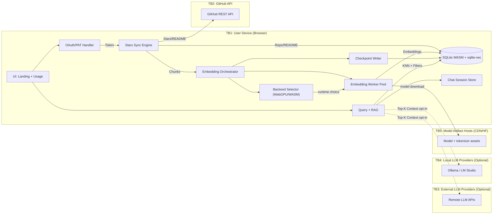
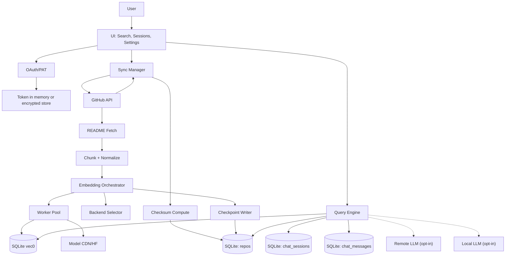

# GitStarRecall - DFD Diagrams

This doc includes a top-level Data Flow Diagram (DFD) with trust boundaries and a detailed DFD for core flows.

---

## 1) Top-Level DFD (With Trust Boundaries)

Trust boundaries:
- TB1: User device / browser runtime
- TB2: GitHub API boundary
- TB3: External LLM providers (optional)
- TB4: Local LLM providers on localhost (optional)
- TB5: Model artifact host/CDN boundary (embedding model downloads)

---

## 2) Detailed DFD (Indexing + Query + Chat)

---

## 3) DFD Notes
- All repo data, embeddings, and chats live inside the browser (SQLite WASM).
- External providers are optional and receive only top-K snippets if enabled.
- Local providers are optional and may be blocked by CORS unless configured.
- Embedding acceleration path remains local-only; no README/chunk content is sent to model hosts beyond normal model file downloads.
